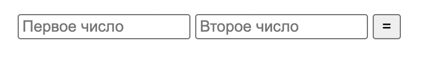
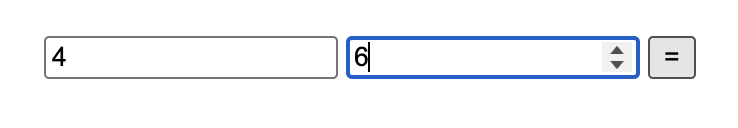
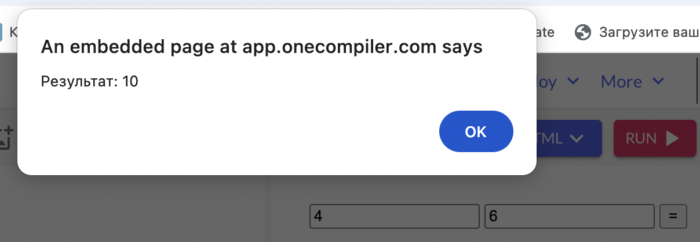
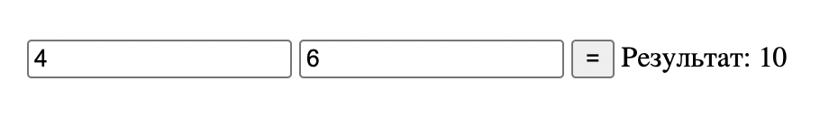
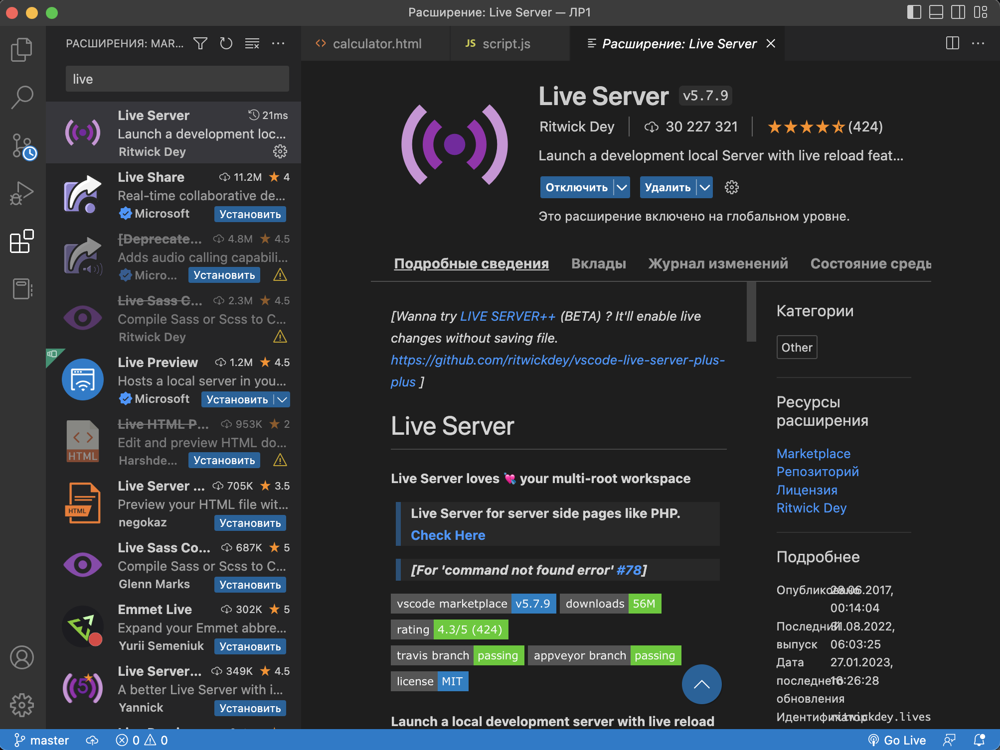
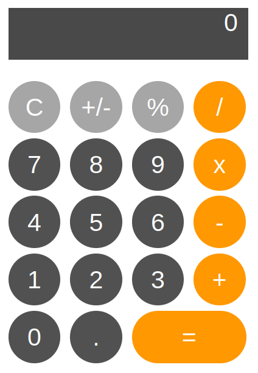
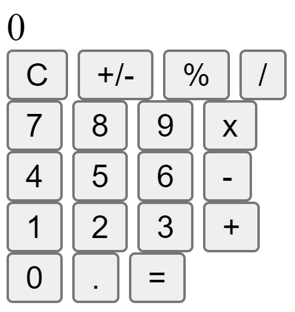
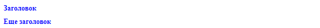
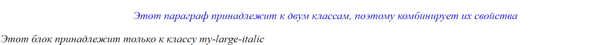

<<<<<<< HEAD:lab2/task.md
# ЛР 2. Calculator. JavaScript

**Цель** данной лабораторной работы - знакомство с инструментами построения пользовательских интерфейсов web-сайтов: HTML, CSS, JavaScript. В ходе выполнения работы, вам предстоит продолжить реализовывать простой калькулятор, и затем выполнить задания по варианту.

## План

1. Программирование логики с помощью JavaScript
2. Доступ к HTML-элементам из JavaScript
3. Программирование кнопок калькулятора
4. Запуск калькулятора с помощью LiveServer
5. Задание

## 1. Программирование логики с помощью JavaScript

Язык программирования JavaScript служит основным инструментом для описания логики и интерактивности веб-страниц. В данной работе с помощью JS мы будем программировать кнопки калькулятора, чтобы они работали.

### Как подключить JavaScript к HTML?

Есть два способа добавить JavaScript на веб-страницу:

1. **Встроенный скрипт** - когда код пишется прямо в HTML-файле внутри тега `<script>`:

```html
<script>
    // Здесь пишем JavaScript код
    console.log("Привет, мир!");
</script>
```

1. **Внешний файл** - когда код хранится в отдельном файле с расширением .js:

```html
<head>
    <title>калькулятор</title>
    <link rel="stylesheet" href="style.css">
    <script type="text/javascript" src="script.js"></script>
</head>
```

Для нашего калькулятора мы будем использовать второй способ, так как это более организованный подход.

## 2. Доступ к HTML-элементам из JavaScript

Чтобы управлять элементами на странице, нам нужно сначала получить к ним доступ. JavaScript предоставляет несколько способов это сделать:

### Основные методы получения элементов

1. **По ID** (метод `getElementById`) - самый распространенный способ:

```html
<body>
    <p id="paragraph" className="textRed">Lorem Ipsum</p>

    <!--вложенный JS-скрипт-->
    <script>
    <!-- обращаемся к HTML-документу и ищем объект с id=paragraph -->
        element = document.getElementById("paragraph")

        <!-- через свойство innerHTML у полученного объекта можно изменить его содержимое-->
        element.innerHTML = "Измененный текст параграфа";
    </script>
</body>
```

1. **По тегу** - получаем все элементы определенного типа:

```js
// Получить все параграфы на странице
let paragraphs = document.getElementsByTagName("p")
```

1. **По классу** - получаем все элементы с определенным классом:

```js
// Получить все элементы с классом "button"
let buttons = document.getElementsByClassName("textRed")
```

про другие способы взаимодействия с HTML-элементами из JS можно почитать [здесь](https://www.w3schools.com/js/js_htmldom.asp).

### Обработчики событий - это функции, которые будут вызываться при совершении какого-либо события. Обработчики событий могут быть привязаны к конкретным элементам или ко всему документу

#### События могут быть разными

События мыши:

- click – происходит, когда кликнули на элемент левой кнопкой мыши (на устройствах с сенсорными экранами оно происходит при касании).
- contextmenu – происходит, когда кликнули на элемент правой кнопкой мыши.
- mouseover / mouseout – когда мышь наводится на / покидает элемент.
- mousedown / mouseup – когда нажали / отжали кнопку мыши на элементе.
- mousemove – при движении мыши.

События на элементах управления:

- submit – пользователь отправил форму \<form>.
- focus – пользователь фокусируется на элементе, например нажимает на \<input>.

Клавиатурные события:

- keydown и keyup – когда пользователь нажимает / отпускает клавишу.

События документа:

- DOMContentLoaded – когда HTML загружен и обработан, DOM документа полностью построен и доступен.

CSS events:

- transitionend – когда CSS-анимация завершена.

И многие другие. В нашем случае мы обрабатываем событие нажатия на кнопку - то есть click.

#### Способы задания обработчиков событий

1. **Через атрибут HTML (inline-обработчик):**

    ```html
    <button onclick="alert('Кнопка нажата!')">Нажми меня</button>
    ```

2. **Через свойство элемента (как в нашем калькуляторе):**

    ```js
    element.onclick = function() {
        alert('Кнопка нажата!');
    }
    ```

3. **Через метод addEventListener (современный способ):**

    ```js
    element.addEventListener('click', function() {
        alert('Кнопка нажата!');
    });
    ```

    или стрелочная функция

    ```js
    element.addEventListener('click', () => {
        alert('Кнопка нажата!');
    });
    ```

4. **Через метод addEventListener с именованной функцией:**

    ```js
    function handleClick() {
        alert('Кнопка нажата!');
    }
    element.addEventListener('click', handleClick);
    ```

Во всех вариантах выше при нажатии на кнопку появится на странице алерт с текстом "Кнопка нажата".

Не рекомендуется использовать Inline-обработчики (через HTML), особенно объемных функций, потому что происходит смешивание HTML и JavaScript, что не является хорошей практикой. В первом и втором способе нельзя задать несколько обработчиков события, что позволяет сделать третий способ. Inlinre-обработчик невозможно удалить во время исполнения программы. AddEventListener имеет более гибкую настройку (например, фаза события и другие опции) и считается современным стандартом.
В нашем калькуляторе мы используем второй способ (через свойство onclick), так как для каждой кнопки нам нужен только один обработчик, и это делает код более простым и понятным.

Функция onсlick имеет объект события, доступ к которому можно получить внутри функции. В примере перечислены некоторые свойства объекта.

```js
element.addEventListener('click', function(event) {
    // вывести тип события, элемент и координаты клика
    alert(event.type + " на " + event.currentTarget);
    alert("Координаты: " + event.clientX + ":" + event.clientY);
});
```

### Прежде, чем оживить калькулятор, рассмотрим сначала самый простой пример с применением выше перечисленных методов: две строки ввода, одна кнопка "=", результат в консоли

Пользователь вводит два числа с клавиатуры, нажимает кнопку "=", результат выводится в алерт.
**HTML:**

```html
<input id="a" type="number" placeholder="Первое число">
<input id="b" type="number" placeholder="Второе число">
<button id="equal">=</button>
```



**JS:**

```js
// обработчик события нажатия на кнопку =
document.getElementById('equal').onclick = function() {
    // получение введенного значения, берем элемент по id, затем смотрим на его значение - value
    // обязательно приводим к числу, потому что знчение value - string,
    // если мы будем складывать стринги, то получим совсем другое ('4' + '6' = '46' - string,  4 + 6 = 10 - number)
    const a = Number(document.getElementById('a').value); // например ввели 4
    const b = Number(document.getElementById('b').value); // например ввели 6
    const sum = a + b;
    alert('Результат: ' + sum); // в алерте увидим: Результат: 10
}
```

**Что происходит:**
Вводим числа в поля, нажимаем "=" — результат появляется в алерте на странице.




---

### Вывод результата на экран (а не в алерт)

Теперь выведем результат не в алерт, а в текстовое поле на страницу.

**HTML:**

```html
<input id="a" type="number" placeholder="Первое число">
<input id="b" type="number" placeholder="Второе число">
<button id="equal">=</button>
<!-- поле в которое выводится результат -->
<span id="result"></span>
```

**JS:**

```js
// обработчик события нажатия на кнопку =
document.getElementById('equal').onclick = function() {
    // получение значений из полей ввода - поле находим по id
    const a = Number(document.getElementById('a').value);
    const b = Number(document.getElementById('b').value);
    const sum = a + b;
    // записываем результат в значение элемента (мы будем в калькуляторе записывать в innerHTML)
    document.getElementById('result').textContent = 'Результат: ' + sum;
}
```

**Что происходит:**
После нажатия "=" результат появляется на странице.



## 3. Программирование кнопок калькулятора

Теперь давайте разберем код калькулятора по частям. У нас число задается по цифрам, а не целиком, как в поле input, поэтому добавим переменные хранения чисел (a и b - достаточно двух, после каждой операции = значение записываем в a, значени b обнуляем), в которые будем записывать введенные цифры, чтобы по итогу получить число. Добавим вспомогательные переменные, чтобы хранить в них значения выбранной операции (чтобы использовать его при нажатии на кнопку =) и результата вычисления, напишем отдельно функцию формирования числа по нажатию на любую цифру и обработчики событий для каждой кнопки.

Файл script.js

### Шаг 1: Инициализация переменных

```js
window.onload = function(){
    // Переменные для хранения чисел и операций
    let a = ''           // Первое число
    let b = ''           // Второе число
    let expressionResult = ''  // Результат вычисления
    let selectedOperation = null  // Выбранная операция
```

### Шаг 2: Получение доступа к элементам калькулятора

Чтобы каждый раз не обращаться к элементам, запомним их в переменные. Поскольку мы их не будем перезаписывать - то переменные будут const

```js
    // Получаем доступ к экрану калькулятора в поле вывода
    const outputElement = document.getElementById("result")

    // Получаем все кнопки с цифрами (их id начинаются с "btn_digit_")
    const digitButtons = document.querySelectorAll('[id ^= "btn_digit_"]')
```

Разберем, что означает этот селектор `[id ^= "btn_digit_"]`:

1. `querySelectorAll()` - метод, который позволяет выбрать все элементы, соответствующие CSS-селектору
2. `[id ^= "btn_digit_"]` - это CSS-селектор атрибутов, где:
   - `id` - атрибут, по которому мы ищем
   - `^=` - оператор "начинается с" (starts with)
   - `"btn_digit_"` - текст, с которого должен начинаться id

Например, этот селектор найдет все элементы с такими id:

- `btn_digit_0`
- `btn_digit_1`
- `btn_digit_2`
- и так далее...

Это удобно, когда у нас есть группа похожих элементов (в нашем случае - кнопки с цифрами), и мы хотим получить их все сразу, не перечисляя каждый id отдельно.

### Шаг 3: Функция обработки нажатия на цифровые кнопки

В этой функции формируется число из переданной цифры и сохраненных ранее значений. Эта функция будет вызываться в обработчике события клика на каждую кнопку с цифрой и точку.

```js
    function onDigitButtonClicked(digit) {
        // Если операция не выбрана, работаем с первым числом (a) - после выбора операции начинается ввод второго числа
        if (!selectedOperation) {
            // Проверяем, не пытаемся ли мы добавить вторую точку
            if ((digit != '.') || (digit == '.' && !a.includes(digit))) {
                // здесь у нас происходит складывание сохраненного уже числа и нажатой цифры. Оба поля string, поэтому
                // каждый раз цифра записывается в конец строки. Например: a = '14', digit = '5',
                // a += digit - это короткая запись a = a + digit - поэтомоу после этой операции a = '145'
                a += digit;
            }
            outputElement.innerHTML = a;
        }
        // Если операция выбрана, работаем со вторым числом (b)
        else {
            if ((digit != '.') || (digit == '.' && !b.includes(digit))) {
                b += digit;
                outputElement.innerHTML = b;
            }
        }
    }
```

### Шаг 4: Настройка обработчиков событий для кнопок

```js
    // Настраиваем обработчики для цифровых кнопок - для каждой кнопки с цифрой и точкой вызываем выше написанную функцию по формированию числа
    digitButtons.forEach(button => {
        button.onclick = function() {
            // берем текст, написанный на кнопке - он и является цифрой
            const digitValue = button.innerHTML;
            onDigitButtonClicked(digitValue);
        }
    });

    // Настраиваем обработчики для кнопок операций - сохраняем выбранную операцию в ранее созданную переменную selectedOperation
    document.getElementById("btn_op_mult").onclick = function() {
        if (a === '') return;
        selectedOperation = 'x';
    }
    document.getElementById("btn_op_plus").onclick = function() {
        if (a === '') return;
        selectedOperation = '+';
    }
    document.getElementById("btn_op_minus").onclick = function() {
        if (a === '') return;
        selectedOperation = '-';
    }
    document.getElementById("btn_op_div").onclick = function() {
        if (a === '') return;
        selectedOperation = '/';
    }
```

### Шаг 5: Кнопка очистки

```js
    // Очищаем все значения при нажатии на кнопку C (вешаем обработчик события click на кнопку С)
    document.getElementById("btn_op_clear").onclick = function() {
        a = ''
        b = ''
        selectedOperation = ''
        expressionResult = ''
        outputElement.innerHTML = 0
    }
```

### Шаг 6: Кнопка равно

```js
    // Вычисляем результат при нажатии на = (вешаем обработчик события click на кнопку =)
    document.getElementById("btn_op_equal").onclick = function() {
        // Проверяем, что у нас есть оба числа и операция
        if (a === '' || b === '' || !selectedOperation)
            return

        // Выполняем выбранную операцию - чтобы не плодить if, воспользуемся удобной и более наглядной функцией сравнения switch, которая на основе значения переданной переменной выполняет нужный кейс. В case указывается ожидаемое точное значение переменной (это может быть любое значение), а затем после : пишется код, который нужно выполнить в данном случае. Case проверяются последовательно, выход из switch происходит при попадании на break или если значение не совпало ни с чем.
        switch(selectedOperation) {
            case 'x':
                expressionResult = (+a) * (+b)
                // обязательно пишется в конце действий case, чтобы выйти из switch, иначе продолжится сравнение case дальше
                break;
            case '+':
                expressionResult = (+a) + (+b)
                break;
            case '-':
                expressionResult = (+a) - (+b)
                break;
            case '/':
                expressionResult = (+a) / (+b)
                break;
            // желательно (но не обязательно) всегда прописывать дефолтное поведение, в случае если в переменной окажется не перечисленное выше значение. в нашем случае это не нужно.
            default:
                break;
        }

        // Сохраняем результат и очищаем второе число, чтобы при новом вводе записывать значение нового числа в b
        a = expressionResult.toString()
        b = ''
        selectedOperation = null

        // Показываем результат на экране
        outputElement.innerHTML = a
    }
};
```

## 4. Запуск калькулятора с помощью LiveServer

Чтобы увидеть наш калькулятор в действии, нам нужно запустить его на веб-сервере. Для этого мы будем использовать расширение Live Server в VS Code:

1. Откройте VS Code
2. Перейдите в раздел расширений (Extensions)
3. Найдите и установите "Live Server"
4. После установки нажмите кнопку "Go Live" в нижней панели VS Code



Теперь ваш калькулятор будет работать в браузере, и вы сможете видеть все изменения в реальном времени!

## 5. Задания для самостоятельной проработки

Попробуйте самостоятельно добавить следующие функции в калькулятор:

1. Запрограммируйте операцию смены знака +/-;
2. Запрограммируйте операцию вычисления процента %;
3. Добавьте кнопку стирания введенной цифры назад (backspace). Расположить кнопку можно, например, на месте нерабочих +/- и % кнопок;
4. Сделайте смену цвета фона по кнопке;
5. Запрограммируйте операцию вычисления квадратного корня √;
6. Запрограммируйте операцию возведения в квадрат x²;
7. Запрограммируйте операцию вычисления факториала x!;
8. Добавьте кнопку, которая за раз добавляет сразу три нуля (000);
9. Запрограммируйте накапливаемое сложние;
10. Запрограммируйте накапливаемое вычитание;
11. Сделайте смену цвета окна вывода результата по кнопке;
12. Добавьте в калькулятор вашу индивидуальную операцию.

### Подсказки для выполнения заданий

1. Для смены знака используйте умножение на -1
2. Для процента делите число на 100
3. Для backspace используйте метод slice() для строк
4. Для смены цвета используйте style.backgroundColor
5. Для корня используйте Math.sqrt()
6. Для квадрата умножьте число на само себя
7. Для факториала используйте цикл или рекурсию
8. Для тройного нуля просто добавьте "000" к строке
9. Для накапливаемых операций сохраняйте предыдущий результат
10. Для индивидуальной операции проявите фантазию!
=======
# ЛР 1. Calculator. HTML/CSS

**Цель** данной лабораторной работы - знакомство с инструментами построения пользовательских интерфейсов web-сайтов: HTML, CSS. В ходе выполнения работы, вам предстоит ознакомиться с кодом реализации простого калькулятора, и затем выполнить задания по варианту.



## План

1. HTML- разметка
2. Базовая структура HTML-документа
3. Создание проекта
4. Верстка калькулятора
5. CSS
6. Применение CSS к HTML-документу
7. Стилизация верстки калькулятора с помощью CSS
8. Задание

## 1. HTML-разметка

HTML - это язык разметки, с помощью которого описывается содержимое веб-страницы: текстовые поля, таблицы, кнопки, заголовки, ссылки, в общем - все, что пользователь видит на странице. Для использования HTML-элементов на странице используются тэги. В основном на каждый элемент в документе приходится по два тэга: открывающий и закрывающий, но для обозначения некоторых элементов достаточно только открывающего. У тэгов могут быть атрибуты, с помощью которых задается дополнительная информация об html-элементе. Синтаксис объявления html-элемента выглядит примерно так:

```html
<тэг атрибут="значение_атрибута">Содержимое тэга</тэг>
```

Рассмотрим некоторые html-элементы и их тэги:

### Текст

1. В html присутствуют 6 тэгов для выделения **заголовков**:

    ```html
    <h1>Этот текст будет отображен браузером как заголовок первого уровня (крупнейший)</h1>
    <h2>А этот - как заголовок второго уровня (поменьше) </h2>
    ...
    <h6>Самый мелкий заголовок</h6>
    ```

2. текст можно форматировать:

    ```html
    <i> Этот текст будет отображен курсивом </i>
    <b> этот будет выделен жирным </b>
    <u> а этот будет подчеркнут </u>
    ```

3. текст можно группировать в параграф (абзац):

    ```html
    <p>Это параграф какого-то текста.</p>
    <p>Следующий параграф текста</p>
    ```

### Списки

1. ненумерованный список (unordered list UL)

    ```html
    <ul> <!-- начинаем ненумерованный список-->
      <li> первый элемент списка </li>
      <li> второй элемент списка </li>
      <li> третий элемент списка </li>
    </ui> <!-- список закончен -->
    ```

2. Нумерованный список (ordered list OL):

    ```html
    <ol>
      <li> первый элемент списка </li>
      <li> второй элемент списка </li>
    </ol>
    ```

### Гиперссылки

1. ссылка на ресурс

    Для создания ссылки используется парный тэг `<a>`. У него присутствует несколько атрибутов, позволяющих ссылку настроить:

    - `href`- адрес ресурса, на который ссылка ссылается, например <https://google.com>
    - `target` - в каком фрейме (окне) открывать документ, по умолчанию стоит в текущем.

        ```html
        <!-- переход по этой ссылке откроет google.com в текущем окне -->
        <a href="https://google.com"> Click me! </a>

        <!-- эта ссылка открое google.com в новом окне браузера -->
        <a href="https://google.com" target="_blank"> Click me! </a>
        ```

2. якорь

    Внутри HTML-страницы с помощью того-же тэга `<a>` можно расставить так называемые “якоря”. Грубо говоря, это - закладки на странице. Якоря затем можно использовать в гиперссылках для перемещения к определенному элементу страницы, где установлен якорь.

    ```html
    <p>
      <a name="some_paragraph"></a>   <!-- устанавливаем якорь -->
      Lorem Ipsum is simply dummy text of ...
    </p>

    <p>
    Следующий параграф текста, в котором мы установим ссылку на якорь.
    <a href="#some_paragraph">При нажатии на эту ссылку, пользователь будет перенаправлен к месту установки якоря.</a>
    </p>
    ```

## 2. Базовая структура HTML-документа

Простейший html-документ выглядит следующим образом:

```html
<!DOCTYPE html> <!--Указание браузеру, какой стандарт HTML использовать (сейчас HTML 5 по умолчанию)-->
<html lang="ru"> <!--Начало html-блока. Можно указать язык, чтобы избежать ошибок отображения текста-->

<!-- секция head, как правило, используется для описания служебной и мета информации,
    в ней также можно указывать ссылки на нужные странице ресурсы, например, шрифты, скрипты и т.д.-->
<head>
  <meta charset="UTF-8">             <!--указание кодировки символов-->
  <title>Моя первая страница</title> <!--Заголовок страницы, который будет отображен во вкладке браузера-->
</head>

<!--секция body - это тело документа. Здесь размещается вся информация, которая будет показана на странице-->
<body>
    <h2>Lorem Ipsum</h2>
</body>

</html> <!--конец html-документа -->
```

HTML-элементов существует большое количество, мы рассмотрели лишь небольшую часть. Почитать про другие HTML-тэги, чтобы научиться вставлять изображения, таблицы, поля ввода, формы и прочее можно [здесь](https://www.w3schools.com/html/default.asp).

## 3. Создание проекта

Для данной лабораторной работы будем использовать [VS Code](https://code.visualstudio.com).

- Заходим в меню создания проекта и выбираем: **Создать файл**
- Создайте HTML-файл: **calculator.html**

## 4. Верстка калькулятора

В HTML-файл поместите следующее содержимое. Здесь определёны все составляющие калькулятора (кнопки и поле вывода результата вычислений). Для каждого активного элемента определен атрибут `id` ( уникальный идентификатор), он потребуется в дальнейшем, чтобы обращаться к элементам из JavaScript.

```html
<!DOCTYPE html>
<html>

<head>
  <title>Калькулятор</title>
</head>

<body>
  <div> <!-- div - это базовый html-контейнер, который может содержать в себе другие html-элементы. -->

    <!-- блок с экраном калькулятора, где будет выводиться результат вычислений. -->
    <div id="result">
      0
    </div>

    <!-- блок с кнопками калькулятора. -->
    <div>
      <!--горизонтальный ряд из четырех кнопок-->
      <div>
        <button id="btn_op_clear">C</button>    <!-- про тэг кнопки: https://www.w3schools.com/tags/tag_button.asp -->
        <button id="btn_op_sign">+/-</button>
        <button id="btn_op_percent">%</button>
        <button id="btn_op_div">/</button>
      </div>

      <div>
        <button id="btn_digit_7">7</button>
        <button id="btn_digit_8">8</button>
        <button id="btn_digit_9">9</button>
        <button id="btn_op_mult">x</button>
      </div>

      <div>
        <button id="btn_digit_4">4</button>
        <button id="btn_digit_5">5</button>
        <button id="btn_digit_6">6</button>
        <button id="btn_op_minus">-</button>
      </div>

      <div>
        <button id="btn_digit_1">1</button>
        <button id="btn_digit_2">2</button>
        <button id="btn_digit_3">3</button>
        <button id="btn_op_plus">+</button>
      </div>

      <div>
        <button id="btn_digit_0">0</button>
        <button id="btn_digit_dot">.</button>
        <button id="btn_op_equal">=</button>
      </div>
    </div>
  </div>
</body>
</html>
```

Если открыть этот HTML-документ в браузере, мы получим не самый изящный калькулятор. Чтобы задать параметры внешнего вида элементов, необходимо использовать CSS.



## 5. CSS

CSS (***Cascading Style Sheets***) - каскадные таблицы стилей. С помощью этого инструмента мы можем кастомизировать отображение различных HTML-элементов на странице, например сделать кнопки круглыми или задать им определенный цвет.

Рассмотрим синтаксис. CSS-правило (стиль) содержит селектор и блок объявлений. Селектор определяет к каким HTML-элементам нужно применить перечисленные в блоке объявлений свойства.

```css
имя_селектора {
  свойство1: значение;
  свойство2: значение;
  ...
}
```

1. **CSS element Selector**

    Существует несколько видов селекторов. Например, если мы хотим задать одинаковые правила для всех заголовков первого уровня, мы можем создать CSS-правило с именем селектора `h1`. Также можно поступить и с другими HTML-элементами.

    ```css
    /* css */
    h1 {
      color: blue;
      font-size: 12px;
    }
    ```

    ```html
    <!-- HTML -->
    <body>
      <h1>Заголовок</h1>
      <h1>Еще заголовок</h1>
    </body>
    ```

    Теперь, при использовании тэга `<h1>` в HTML документе, ко всем заголовкам первого уровня будут применены заданные правила: синий цвет и размер шрифта в 12px.

    

2. **CSS id Selector**

    Селектор по идентификатору позволяет задать правила для конкретного HTML-элемента с конкретным уникальным идентификатором. Имя такого селектора совпадает с идентификатором HTML-элемента, но начинается с решётки:

    ```html
    <!-- HTML -->

    <div id="my_custom_element">
      Lorem Ipsum is simply dummy text
    </div>
    ```

    ```css
    /*  css */
    #my_custom_element {
          text-align: center;
          color: red;
    }
    ```

3. **CSS class Selector**

    У HTML-элементов есть атрибут **class**. Классовый селектор применяет заданные CSS свойства к тем HTML-элементам, которые принадлежат конкретному классу. Причем один HTML-элемент может принадлежать сразу к нескольким классам. Имя такого селектора начинается с точки.

    ```css
    /* css */

    /* синий текст по центру */
    .my-centered-blue {
      text-align: center;
      color: blue;
    }

    /* огромный текст курсивом */
    .my-large-italic {
      font-size: xxx-large;
      font-style: italic;
    }
    ```

    ```html
    <!-- HTML -->

    <p class="my-centered-blue my-large-italic">
      Этот параграф принадлежит к двум классам, поэтому комбинирует их свойства
    </p>
    <div class="my-large-italic">
      Этот блок принадлежит только к классу my-large-italic
    </div>
    ```

    

Также можно создать классовый селектор, дейсвующий только на конкретный тип HTML-элементов, например на параграфы:

```css
/* css */

p.my-large-italic {
  font-size: xxx-large;
  font-style: italic;
}
```

## 6. Применение CSS к HTML-документу

Существует несколько вариантов встраивания CSS-правил в HTML-документ. CSS можно расположить в секции `<head>`, в рамках тэга `<style>`

```html
<!-- HTML -->
<head>
  <title>калькулятор</title>
  <style>
    .my-center-red {
      color: red;
      text-align: center;
    }
  </style>
</head>

<body>
    <p class="my-center-red"> Hello! </p>
</body>
```

Второй, более предпочтительный, вариант - описание CSS стилей в отдельном файле, подключить который к HTML-документу можно сославшись на него в секции `head`:

```html
<head>
  <title>калькулятор</title>
  <!-- указываем, что файл style.css содержит таблицу стилей (stylesheet) -->
  <link rel="stylesheet" href="style.css">
</head>
```

Браузер, читая html документ подгрузит стили из этого файла.

Также есть возможность задать стиль для элемента напрямую через атрибут style, но делать так не рекомендуется:

```html
<button style="margin-right: 5px; backgroud: red;">Красная кнопка</button>
```

## 7. Стилизация верстки калькулятора с помощью CSS

Приступим к стилизации созданной ранее верстки калькулятора. Создайте css-файл и пропишите в нем стили для элементов калькулятора: кнопок и окна вывода.

```css

/* опишем базовый стиль кнопки калькулятора */
.my-btn {
  margin-right: 5px;           /* задаем отступ от кнопки справа */
  margin-top: 5px;             /* задаем отступ от кнопки сверху*/
  width: 50px;                 /* задаем ширину кнопки */
  height: 50px;                /* задаем высоту кнопки */
  border-radius: 50%;          /* округляем кнопку */
  border: none;                /* отключаем обводку */
  background: #515151;         /* задаем серый цвет кнопки */
  color: white;                /* задаем белый цвет текста внутри кнопки */
  font-size: 1.5rem;           /* увеличим размер шрифта */
  font-family: Arial, Helvetica, sans-serif; /* сменим шрифт */
  cursor: pointer;             /* при наведении на кнопку курсор будет изменен
                                  со стрелки на 'указательный палец' */
  user-select: none;           /* отключаем возможность выделить текст внутри кнопки */
}

/* hover - это состояние элемента, когда на него наведен курсор */
.my-btn:hover {
  background: darkgray; /* при наведение курсора на кнопку, она будет окрашена в серый */
}

/* active - это состояние активации элемента. В случае кнопки - нажатие на нее */
.my-btn:active {
  filter: brightness(130%); /* увеличим интенсивность цвета для эффекта вспышки */
}

/* селектор для кнопок первостепенных операций */
.my-btn.primary {
  background: #ff9801; /* цвет кнопки оранжевый */
}

/* селектор для кнопок второстепенных операций */
.my-btn.secondary {
  background: #a6a6a6; /* цвет кнопки сервый */
}

/* селектор для кнопки расчета выражения (=) */
.my-btn.execute {
  width: 110px;          /* сделаем кнопку шире других */
  border-radius: 34px;   /* подкорректируем округлость */
}

/* селектор для поля вывода результата */
.result {
  width: 220px;
  height: 50px;
  margin-bottom: 15px;         /* отступ снизу */
  padding-right: 10px;         /* выступ справа */
  background: rgb(73, 73, 73); /* цвет можно задавать и таким образом */
  text-align: right;           /* примагнитим текст к правой стороне */
  color: #ffffff;              /* цвет текста белый */
  font-size: 1.5rem;
  font-family: Arial, Helvetica, sans-serif;
}
```

Теперь заполним атрибут `class` у HTML-элементов калькулятора, чтобы применить к ним созданные стили:

1. Кнопки циферблата: 0-9 и точка относятся к классу `my-btn`:

    ```html
    ...
    <button id="btn_digit_7" class="my-btn">7</button>
    <button id="btn_digit_8" class="my-btn">8</button>
    <button id="btn_digit_9" class="my-btn">9</button>
    ...
    ```

2. Кнопки второстепенных операций (C, +/-, %) принадлежат классам `my-btn` и `secondary`:

    ```html
    ...
    <button id="btn_op_clear" class="my-btn secondary">C</button>
    <button id="btn_op_sign" class="my-btn secondary">+/-</button>
    <button id="btn_op_percent" class="my-btn secondary">%</button>
    ...
    ```

3. Кнопки первостепенных операций принадлежат к классам `my-btn` и `primary`:

    ```html
    <button id="btn_op_mult" class="my-btn primary">x</button>
    ...
    <button id="btn_op_minus" class="my-btn primary">-</button>
    ...
    <button id="btn_op_plus" class="my-btn primary">+</button>
    ```

4. Кнопка “=” дополнительно относится еще и к классу `execute`:

    ```html
    <button id="btn_op_equal" class="my-btn primary execute">=</button>
    ```

5. Блок с экраном калькулятора относим к классу `result`:

    ```html
    <div id="result" class="result">
      0
    </div>
    ```

Если все выполнено верно, изображение страницы должно соответствовать требуемому.

## 8. Задания для самостоятельной проработки

1. Поменяйте цветовую палитру калькулятора с оранжево-серой на любую другую;
2. Сделайте фон калькулятора темным (наподобие ночной темы);
3. Сделайте кнопки квадратными вместо круглых.;
4. Измените цвет вывода результата на любой другой;
5. Сделайте окно вывода со скруглеными краями;
6. Поменяйте шрифт цифр;
7. Сделайте шрифт более толстым;
8. Измените цвет при наведении мышки на кнопку на другой;
9. Добавьте надпись внизу "ЛР выполнена ФИО";
10. Выровняйте калькулятор по центру;
11. Увеличьте размер окна вывода;
12. Добавьте кнопку для смены темы (смена цвета фона);
13. Сделайте шрифт тоньше;
14. Смените цвет шрифта;
15. Добавьте любое изображение на фон;
16. Добавьте кнопку со ссылкой на GitHub;
17. Сделайте поле с выпадающим списком;
18. Сделайте сворачивающиеся и разворачивающиеся подробности (Автор -> ФИО, Группа);
19. Добавьте поле с целью ЛР и подсветить слова: знакомство, HTML, CSS (с помощью тега).
20. Скопируйте для калькулятора стилистику веб-ресурса, которая не будет повторяться с остальными студентами
>>>>>>> master:lab1/task.md
